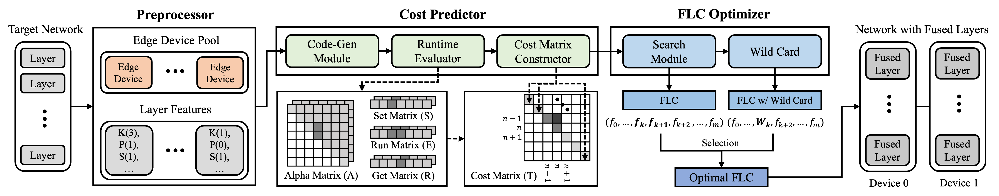
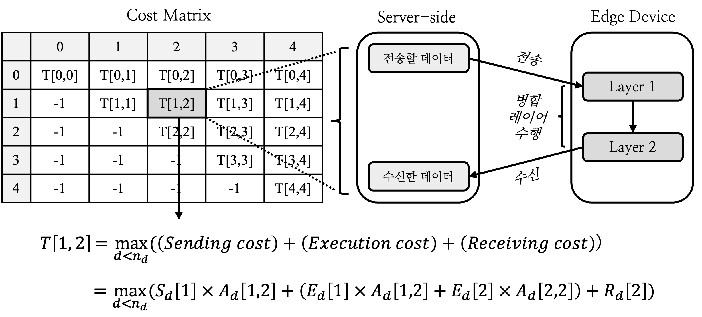
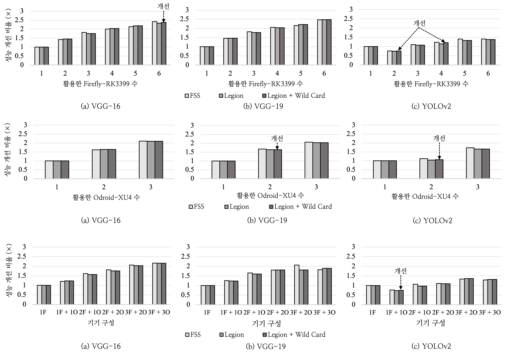
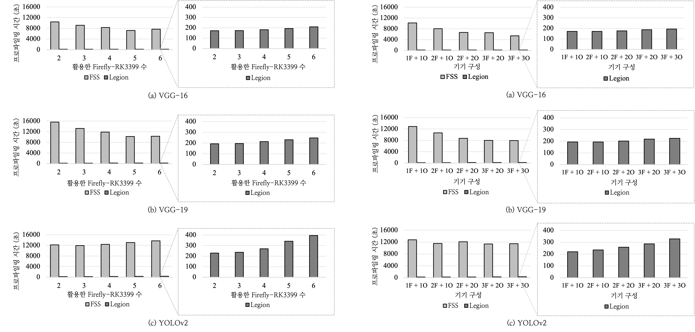

## Efficient Fused-layer Cost Estimation

"*Legion: Tailoring Grouped Neural Execution Considering Heterogeneity on Multiple Edge Devices (ICCD'21)*" 논문의 기반 연구 내용을 요약한 레포지토리입니다.

[(Choi, K., Lee, S., Kang, B. W., & Park, Y. (2021, October). Legion: Tailoring Grouped Neural Execution Considering Heterogeneity on Multiple Edge Devices. In *2021 IEEE 39th International Conference on Computer Design (ICCD)* (pp. 383-390). IEEE.)](https://ieeexplore.ieee.org/abstract/document/9643757/)

 

### 목차

1. [연구 개요](#연구-개요)
2. [코멘트](#코멘트)

 

### 연구 개요

#### 배경

- 서버 대비 비교적 성능이 낮은 엣지 디바이스에서 모델 추론 시 실시간 처리 애플리케이션의 요구사항을 충족하기 어려울 수 있습니다.
- 병렬화 기법 중 입력 데이터를 특정 차원에 따라 분할하여 각 기기가 각 레이어의 전체 연산 중 일부만을 맡도록 하는 모델 병렬화 방식을 활용하면 개별 기기에서의 연산 부담을 줄이고 추론 지연 시간을 단축할 수 있습니다.
- 모델 병렬화 방식에서 각 기기에서 수행한 결과를 취합하고 다시 입력 데이터를 분할하는 과정에서 데이터 통신 오버헤드가 적지 않으므로, 레이어를 병합하여 해당 그룹 내에서는 통신이 발생하지 않도록 하면 시스템 전반의 효율성을 높일 수 있습니다.
- 레이어 병합 조합(Fused-layer Configuration, *FLC*) 및 입력 데이터 분할 비율에 대한 탐색 공간이 넓어 이를 효율적으로 수행할 필요가 있습니다.

 

#### 제안

- 본 연구에서 제안하는 *Legion* 프레임워크의 구성 요소 및 흐름을 나타낸 그림입니다.
- *Preprocessor*는 대상 모델 내 모델의 특징을 정리하고, 활용할 엣지 디바이스와의 RPC 연결을 수행합니다.
- *Cost Predictor*는 각 기기에서의 병합 이전 단일 레이어의 수행 비용을 프로파일링 해 여러 종류의 표에 각각 기록하고, 이를 기반으로 모든 병합 레이어의 수행 시간을 예측합니다. 이때 각 기기는 성능에 기반하여 서로 다른 입력 데이터 크기를 할당 받도록 합니다.
  - *Set* (*S*) / *Get Matrix* (*R*): 각각 입력 데이터 및 출력 데이터 전송 시간을 저장합니다.
  - *Run Matrix* (*E*): 특정 레이어 연산 수행 시간을 저장합니다.
  - *Alpha Matrix* (*A*): 레이어 병합으로 인해 증가하는 오버헤드를 *알파(alpha)*라는 비율 값으로서 표기하여 저장합니다.

- FLC Optimizer는 예측된 병합 레이어 수행 시간을 기반으로 최적의 레이어 병합 조합을 탐색합니다.
  - 상황에 따라 약간의 예측 오차로 최적의 조합을 놓칠 수 있으므로, 가장 효율적일 것으로 보이는 레이어 그룹 간 병합을 1회 더 진행하는 *Wild Card* 로직을 적용한 FLC와 이전에 찾아둔 FLC를 비교해 최적의 FLC를 최종적으로 결정합니다.

 

- 특정 병합 레이어의 예측 비용은 다음 세 값의 합으로 표현됩니다.
  - 증가한 입력 데이터 비율만큼 기존 전송 비용에 알파 값을 곱합니다.
  - 병합 레이어를 구성하는 각 단일 레이어의 기존 수행 비용에 대응되는 알파 값을 각각 곱해 더합니다.
  - 취합 후 출력 데이터의 크기는 변하지 않으므로 기존 전송 비용을 그대로 활용합니다.

 

#### 결과

##### 최적 병합 조합의 추론 속도 비교

- *Firefly-RK3399*(*F*)만을 최대 6대까지 활용할 때(1행), *Odroid-XU4*(*O*)만을 최대 3대까지 활용할 때 (2행), 그리고 두 종류의 기기를 조합하여 최대 6대(*nF + mO*: *Firefly* *n*대와 *Odroid* *m*대 혼용)까지 활용할 때(3행), 전체 탐색 방식(*Full Searching Scheme*, *FSS*) 대비 Legion이 찾은 최적의 탐색 조합의 병렬화 성능을 비교한 것입니다.
- 더 적은 프로파일링 비용이 요구되는 *Legion*의 탐색 기법을 활용할 때, 대부분의 상황에서 전체 탐색 방식과 비슷한 병렬화 수준을 보인 것을 확인할 수 있습니다.

 

- 위와 같은 방식으로 두 종류의 기기를 활용해 전체 탐색 방식 대비 *Legion*의 탐색 기법 활용 시 프로파일링을 위한 총 소요 시간을 비교한 것입니다.
- 모델 및 기기 구성 별로 평균 28~66배 가량 더 빠른 탐색이 가능함을 확인하였습니다.

 

### 코드 설명

#### 테스트 환경

- Server
  - Intel i7-8700K / DDR4 16GB
  - Ubuntu 20.04 LTS, Python 3.8
  - TVM 0.8.0dev0, LLVM 8.0.0

 

- Edge (with 100 Mbps ethernet connection)
  - Firefly-RK3399
    - Cotex-A72 (1.8 GHz Dual Core) + Cortex-A53 (1.1 GHz Quad Core)
    - Ubuntu 16.04 LTS, Python 3.6
    - TVM 0.8.0dev0, LLVM 8.0.0
  - Odroid-XU4
    - Cortex-A15 (2.0 GHz Quad Core) + Cortex-A7 (1.4 GHz Quad Core)
    - Ubuntu 16.04 LTS, Python 3.6
    - TVM 0.8.0dev0, LLVM 8.0.0
  - 100 Mbps Ethernet Connection

 

### 코멘트

#### 연구 동기

- 본 연구는 다음 선행 연구로부터 큰 motivation을 얻었습니다.
  - [Zhou, L., Samavatian, M. H., Bacha, A., Majumdar, S., & Teodorescu, R. (2019, November). Adaptive parallel execution of deep neural networks on heterogeneous edge devices. In *Proceedings of the 4th ACM/IEEE Symposium on Edge Computing* (pp. 195-208).](https://dl.acm.org/doi/abs/10.1145/3318216.3363312)

- 다만, 본 연구에서는 프로파일링 데이터 수집 비용을 고려하여 각 기기의 연산 수행 및 데이터 통신 시간 예측을 위한 모델을 학습해 활용하는 것을 지양하려고 하였습니다.

 

#### 개선 의견

- 성능 비교 실험 시 기존 연구에서 제안한 각 기기에서의 소요 시간 예측 모델을 비슷하게나마 구축하여 이를 함께 비교할 수 있었다면 더 정확한 데이터를 제공할 수 있었을 것으로 생각하고, 관련해 해당 사항을 개선 시도해 볼 의지가 있습니다.
- 잔차 연결(skip connection) 등이 더 적극적으로 활용된 모델 등에 대해서 병렬화 성능을 높일 수 있도록 스케줄링 로직을 개선할 수 있으면 더 좋은 프레임워크가 될 수 있을 것 같습니다.
- 더 큰 규모의 모델을 더 좋은 성능의 기기에 대해 적용해 보고, 해당 결과를 제시할 수 있으면 좋을 것 같습니다.
